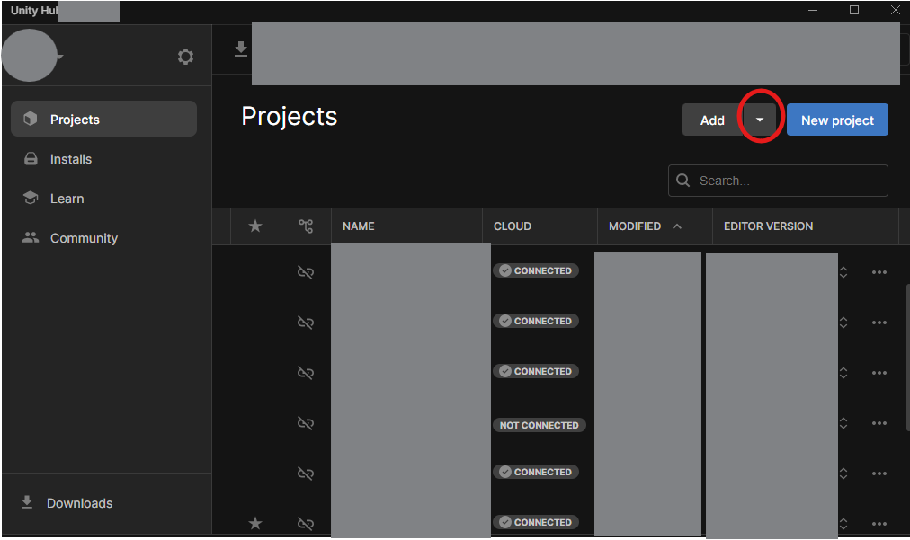
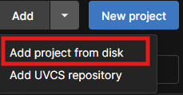

# RATS

## Automatic Deployment

## Manual Deployment

## Version

"rats" uses `Unity 2022.3.43f1`

current CI / CD libs requires our version to be on the game ci host [game.ci/docs/docker/versions/](https://game.ci/docs/docker/versions/) (fixed)

## Set Up / Initialization

**Clone the repository to your local machine**

* Navigate to the directory you want the repo in

* Clone the repository with `git clone https://github.com/hjc2/rats`

**Open in Unity**

* Open Unity Hub

* Click dropdown icon on "Add" button

* Click "Add project from disk"

 

* Select your project folder and and click "Add Project"

## CI / CD

`Test Build` builds the Unity project and reports if it was successful - this runs on branches, tags, pr's

`Build and Deploy` builds the Unity project and deploys to GitHub sites - this should only run on main getting updated.
